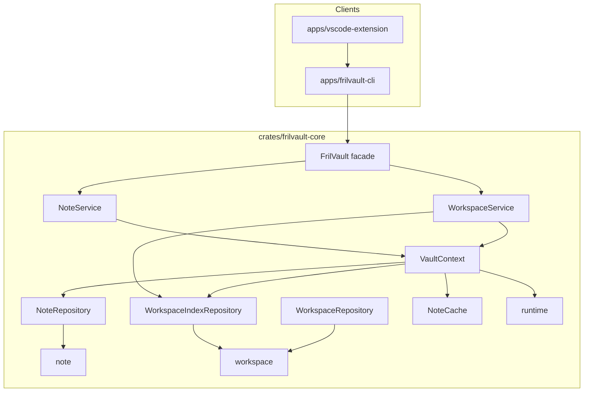
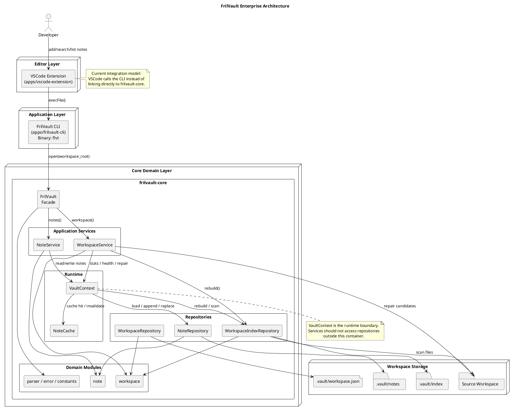
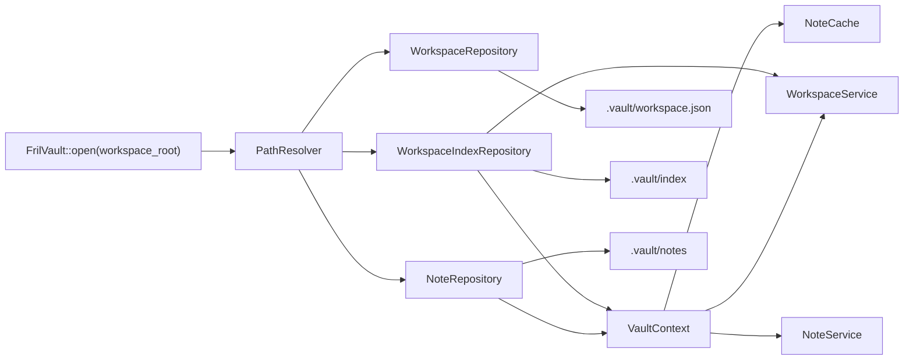
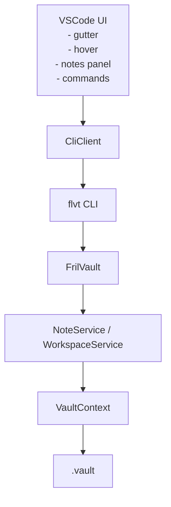
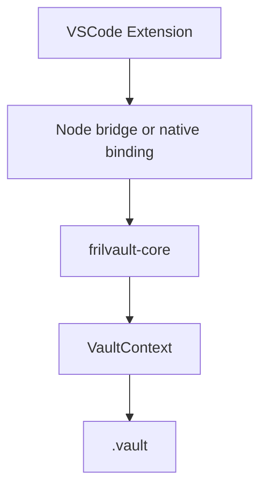

# 📘 FrilVault Architecture

## Version

v0.1 (Current Core + VaultContext + Cache Transition)

---

# 1. Vision

FrilVault is a developer-focused personal knowledge vault.

It allows developers to attach structured, persistent notes to source code without modifying the code itself.

The system acts as a **knowledge layer on top of codebases**, not a code annotation tool.

---

# 2. Core Principles

## 2.1 Local First

All data is stored locally inside the `.vault` directory.

No external service dependency exists.

---

## 2.2 Source Code Integrity

FrilVault must never modify source files.

All metadata and notes are stored externally.

---

## 2.3 Shared Core Logic

All clients must reuse `frilvault-core` as the single source of truth.

No business logic duplication in:

- CLI
- VSCode extension
- Node bridge

---

## 2.4 Runtime-Centric Design

The system introduces a runtime container:

> VaultContext

This is responsible for:

- caching
- repository coordination
- index access
- runtime optimization

---

## 2.5 Editor-Agnostic Design

VSCode is an integration layer, not the system boundary.

Future editors must be able to integrate without modifying core logic.

---

# 3. Repository Architecture

```text
frilvault
├── crates
│   └── frilvault-core
│
└── apps
    ├── frilvault-cli
    └── vscode-extension
```

## 3.1 Current Structure (Mermaid)



## 3.2 Enterprise Architecture (PlantUML)



---

# 4. Core Architecture (frilvault-core)

## 4.1 Module Structure

```text
frilvault-core
├── note
│   ├── dto
│   ├── entity
│   ├── note_repository
│   └── note_service
│
├── workspace
│   ├── diff
│   ├── entity
│   ├── path
│   ├── repository
│   └── service
│
├── parser
├── runtime
├── app
├── constants
└── error
```

---

## 4.1.1 Core Runtime View (Mermaid)



---

## 4.2 Responsibilities

### Note Domain

Responsible for:

- CRUD operations
- line-based anchors
- symbol-based anchors
- note search
- JSON persistence

---

### Workspace Domain

Responsible for:

- workspace indexing
- statistics
- health checks
- repair suggestions
- repair execution

---

### VaultContext (Runtime Core)

VaultContext is the runtime container of FrilVault.

It owns:

- NoteRepository
- WorkspaceIndexRepository
- NoteCache

Responsibilities:

- cache-aware note loading
- cache invalidation
- unified access layer for services

---

### Cache Layer

In-memory optimization layer used only in long-running processes.

Current responsibilities:

- note caching
- future: index cache, symbol cache

Important:

CLI usage is short-lived; cache is primarily useful for VSCode and Node runtime.

---

# 5. Service Layer

## 5.1 NoteService

Responsible for:

- note CRUD orchestration
- search coordination
- interaction with VaultContext

Important:

- Must not directly access repositories
- Must go through VaultContext

---

## 5.2 WorkspaceService

Responsible for:

- workspace statistics
- health checking
- repair system
- file scanning

Important:

- Uses both index data and note data via VaultContext

---

# 6. Storage Model

```text
.vault
├── notes
├── cache
├── index
└── workspace.json
```

---

# 7. Repair System

## Flow

```text
health_check
↓
repair_suggestions
↓
apply_repairs
```

---

## Current Implementation

- filename-based matching
- heuristic candidate selection

---

## Future Improvements

- symbol-aware repair
- interactive selection
- semantic matching

---

# 8. Runtime Data Flow

## 8.1 Read Path

```text
Client (CLI / VSCode)
↓
Service
↓
VaultContext
↓
Cache (hit/miss)
↓
Repository (fallback)
↓
Filesystem (JSON)
```

---

## 8.2 Write Path

```text
Client
↓
Service
↓
Repository
↓
Filesystem
↓
Cache invalidation
```

---

# 9. Editor Integration Model

## 9.1 VSCode Architecture (Current)



---

## 9.2 Target Architecture



---

## 9.3 Features Owned by VSCode Layer

- gutter decorations
- hover previews
- sidebar panels
- commands UI

No business logic allowed here.

---

# 10. Key Design Constraints

## 10.1 Single Source of Truth

All logic must live in:

> frilvault-core

---

## 10.2 No Repository Leakage

Services must not directly depend on repositories.

All access goes through VaultContext.

---

## 10.3 Cache Transparency

Cache must be invisible to clients.

Clients should not know whether data is cached or loaded from disk.

---

# 11. Target Evolution

## Current State

- Core fully functional
- Cache introduced
- VaultContext introduced
- CLI stable
- Repair system functional

---

## Next State

- full VaultContext adoption
- unified service layer
- cache-driven reads
- VSCode integration stabilization

---

## Future State

- symbol resolution engine
- watcher system
- semantic search
- AI context layer
