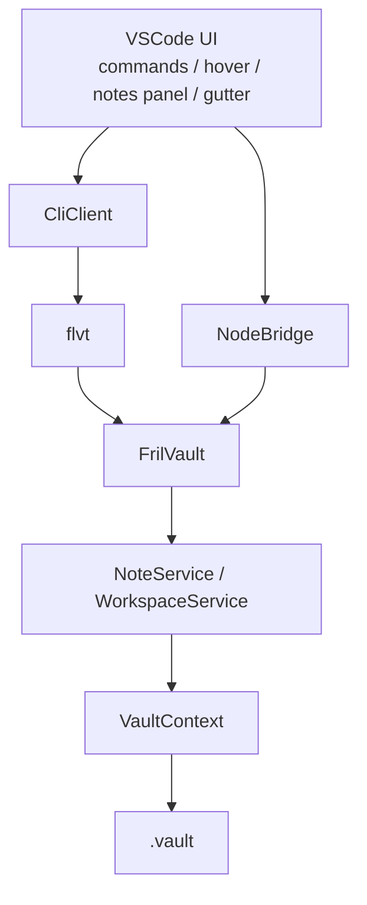

# Editor Diagram

The current VS Code integration is hybrid: some commands go through the CLI, while others call a native Node bridge.

```mermaid
flowchart TD
    Editor["VSCode UI
    commands / hover / notes panel / gutter"] --> CliClient["CliClient"]
    Editor --> NodeBridge["NodeBridge"]
    CliClient --> Binary["flvt"]
    Binary --> Facade["FrilVault"]
    NodeBridge --> Facade
    Facade --> Services["NoteService / WorkspaceService"]
    Services --> Context["VaultContext"]
    Context --> Storage[".vault"]
```
