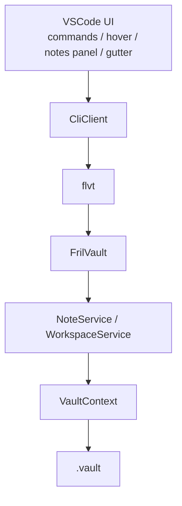

# Editor Diagram

The current VS Code integration uses the CLI as the execution bridge into the shared Rust core.

```mermaid
flowchart TD
    Editor["VSCode UI
    commands / hover / notes panel / gutter"] --> CliClient["CliClient"]
    CliClient --> Binary["flvt"]
    Binary --> Facade["FrilVault"]
    Facade --> Services["NoteService / WorkspaceService"]
    Services --> Context["VaultContext"]
    Context --> Storage[".vault"]
```
