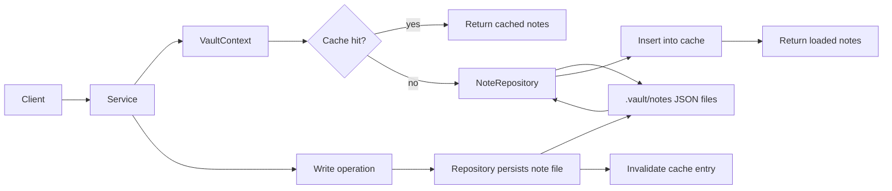

# Runtime Diagram

This view focuses on cache behavior and repository fallback.

```mermaid
flowchart LR
    Client --> Service
    Service --> VaultContext
    VaultContext --> Cache{"Cache hit?"}
    Cache -->|yes| Cached["Return cached notes"]
    Cache -->|no| Repository["NoteRepository"]
    Repository --> Filesystem[".vault/notes JSON files"]
    Filesystem --> Repository
    Repository --> Populate["Insert into cache"]
    Populate --> Result["Return loaded notes"]

    Service --> Write["Write operation"]
    Write --> RepositoryWrite["Repository persists note file"]
    RepositoryWrite --> Filesystem
    RepositoryWrite --> Invalidate["Invalidate cache entry"]
```
