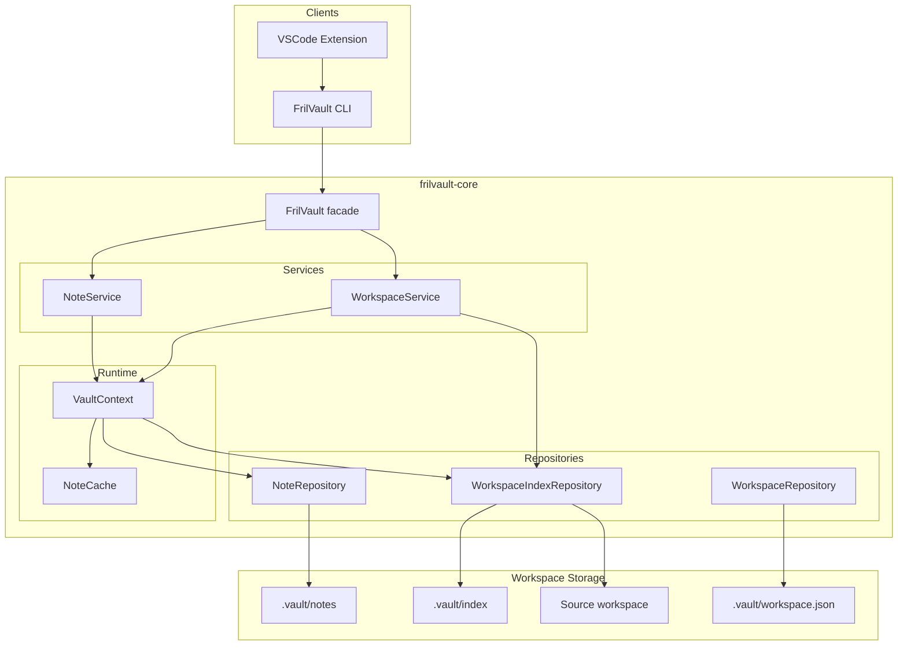

# System Diagram

This view shows FrilVault as an enterprise-style system with client surfaces, a shared core, and workspace-local storage.

```mermaid
flowchart TD
    subgraph Clients
        CLI["FrilVault CLI"]
        VSCode["VSCode Extension"]
    end

    subgraph Core["frilvault-core"]
        Facade["FrilVault facade"]

        subgraph Services
            NoteService
            WorkspaceService
        end

        subgraph Runtime
            VaultContext
            NoteCache
        end

        subgraph Repositories
            NoteRepository
            WorkspaceIndexRepository
            WorkspaceRepository
        end
    end

    subgraph Storage["Workspace Storage"]
        Source["Source workspace"]
        Notes[".vault/notes"]
        Index[".vault/index"]
        Meta[".vault/workspace.json"]
    end

    VSCode --> CLI
    CLI --> Facade
    Facade --> NoteService
    Facade --> WorkspaceService
    NoteService --> VaultContext
    WorkspaceService --> VaultContext
    WorkspaceService --> WorkspaceIndexRepository
    VaultContext --> NoteCache
    VaultContext --> NoteRepository
    VaultContext --> WorkspaceIndexRepository
    NoteRepository --> Notes
    WorkspaceIndexRepository --> Index
    WorkspaceRepository --> Meta
    WorkspaceIndexRepository --> Source
```
