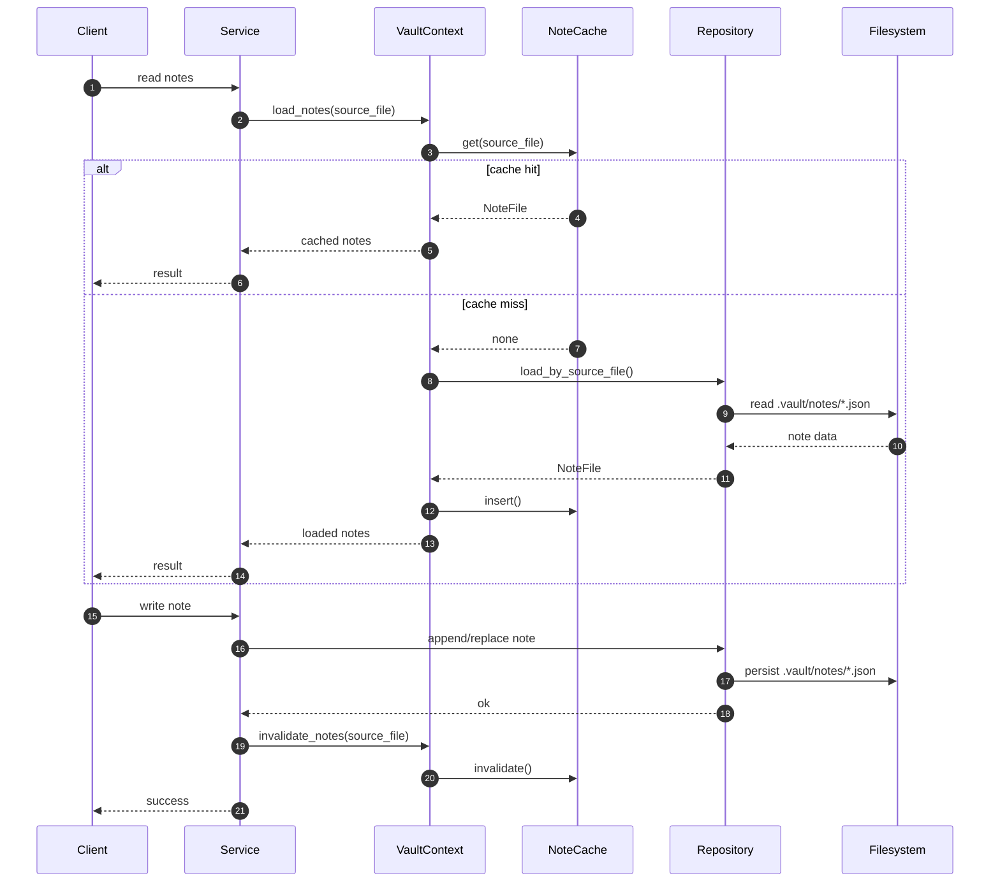

# Runtime Flow

FrilVault runtime behavior is built around service orchestration, repository fallback, and cache-aware note loading.

## Read Flow

The read path starts from a client surface such as the CLI or VS Code:

1. client requests note or workspace data
2. service calls into `VaultContext`
3. `VaultContext` checks `NoteCache`
4. on miss, repository loads persisted data from `.vault`
5. loaded notes are cached for subsequent access

## Write Flow

Write operations follow a stricter persistence-first path:

1. client issues a mutation request
2. service validates and transforms the request
3. repository writes the updated note file
4. `VaultContext` invalidates affected cache entries

This keeps persisted state authoritative and prevents stale cache reuse.

## Cache Behavior

`NoteCache` is currently an in-memory optimization for long-running processes.

### Cache Hit

- `VaultContext::load_notes()` finds an entry in `NoteCache`
- the cached `NoteFile` is returned immediately
- filesystem access is skipped

### Cache Miss

- `VaultContext::load_notes()` falls back to `NoteRepository`
- repository loads note JSON from `.vault/notes`
- loaded data is inserted into `NoteCache`

## Repository Fallback Logic

Repositories are the persistence boundary:

- `NoteRepository` manages note-file reads and writes
- `WorkspaceIndexRepository` rebuilds and loads workspace index data
- `WorkspaceRepository` manages workspace metadata

Services should not bypass this layer. Runtime policy belongs in `VaultContext`, while persistence policy belongs in repositories.

## Mermaid View

