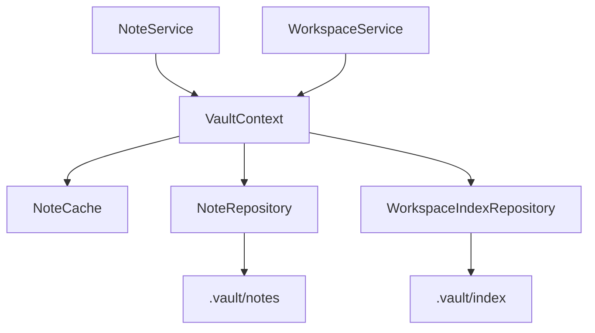

# VaultContext

`VaultContext` is the runtime container for FrilVault.

It exists to centralize stateful runtime concerns that should not be spread across services or clients.

## Owned Resources

The current `VaultContext` owns:

- `NoteRepository`
- `WorkspaceIndexRepository`
- `NoteCache`

This gives services a single place for note loading, index rebuilds, cache invalidation, and workspace scans.

## Coordination Role

`VaultContext` coordinates three concerns:

### Cache

- checks for cached note files
- stores freshly loaded note data
- invalidates entries after writes

### Repository Access

- delegates note persistence to `NoteRepository`
- delegates index rebuilds to `WorkspaceIndexRepository`
- exposes helper operations such as listing note files and scanning workspace files

### Service Boundaries

- `NoteService` uses `VaultContext` for cache-aware note access
- `WorkspaceService` uses `VaultContext` for index rebuilds, scans, and repair inputs

## Why It Matters

Without `VaultContext`, each service would need to understand cache policy and repository wiring independently. That would duplicate logic and make long-running integrations harder to evolve.

The current codebase has not fully completed that move yet. Some flows still hold direct repository access alongside the context. Even so, `VaultContext` is the correct boundary for future consolidation.

By keeping runtime policy in one place, FrilVault can later add:

- broader cache layers
- smarter invalidation
- watcher integration
- richer runtime diagnostics

## Container View

